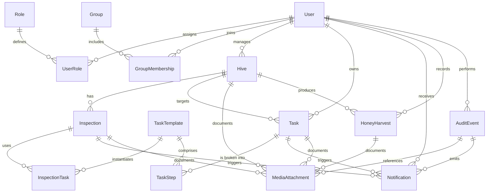

# BusMedaus Data Model Overview

This document captures the initial entity relationship diagram (ERD) for the BusMedaus beekeeping management platform and a summary of the initial asynchronous stakeholder review.

## ERD (Mermaid)

## Entity Summaries

- **User** – Apiarists, inspectors, and administrators authenticated in the platform. Users can be assigned roles, grouped into crews, own hives, complete inspections, and receive notifications.
- **Role** – Named permissions bundles (e.g., `admin`, `inspector`, `beekeeper`). Roles are mapped to users via the `UserRole` join table to support many-to-many assignments.
- **Group** – Operational crews or regions. Memberships are stored in `GroupMembership` so a user can join multiple groups.
- **Hive** – A managed beehive including metadata such as apiary location, queen status, temperament, and current health rating.
- **Inspection** – Observations captured during hive inspections. Linked to the hive inspected, the inspector, any templates used, and follow-up tasks.
- **TaskTemplate** – Standard operating procedures broken into reusable `TaskStep` records. Templates are used to pre-populate inspection checklists.
- **Task** – Actionable work items (e.g., follow-up activities) assigned to users and optionally linked to a hive or inspection. Tasks are decomposed into ordered steps that can be individually completed.
- **TaskStep** – Fine-grained steps for both templates and live tasks. Template steps define expected sequences; task steps track execution state.
- **InspectionTask** – Join table linking an inspection to the templates applied and capturing overrides (status, notes) per inspection.
- **Notification** – In-app and email alerts delivered to users for important events (new tasks, overdue steps, harvest approvals, audit alerts).
- **HoneyHarvest** – Records of honey collections from hives, including yield, moisture content, and certifying user.
- **MediaAttachment** – Photos, videos, or documents attached to inspections, tasks, harvest logs, or audit events. Stored in object storage with metadata.
- **AuditEvent** – Immutable log of security-sensitive events (login, permission changes, data exports). References the acting user and impacted entity (type/id pair).

## Stakeholder Review Notes

A draft of this ERD was circulated to product, operations, and compliance stakeholders via the architecture channel on 2024-XX-XX. Key feedback captured for the next revision:

1. Expand inspection templating to allow seasonal variants and crew-specific defaults.
2. Ensure notifications capture delivery medium (push/email/SMS) and support batching.
3. Confirm audit events retain IP address and user agent for compliance reporting.

These items have been logged as follow-up requirements and will be reflected in subsequent schema iterations.
